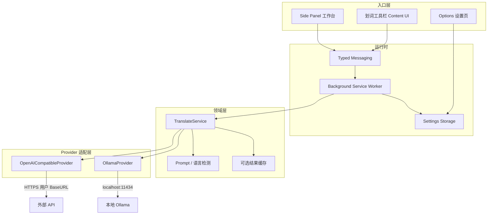
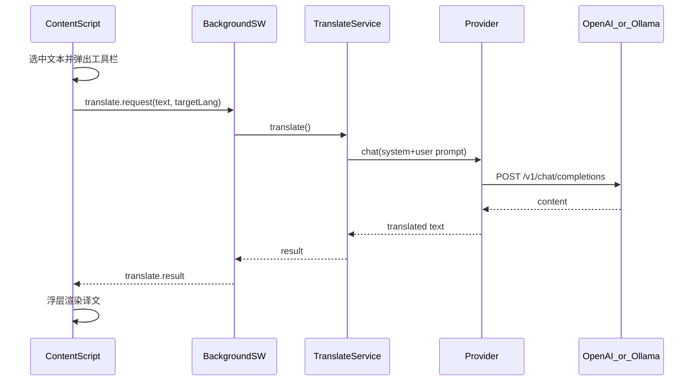

# DualMind 浏览器插件 · 技术架构（V1）

## 产品定位与边界

- **定位**：网页场景 AI 助手；V1 以翻译切入，后续扩展摘要/聊天/写作，再后置浏览器操作。
- **V1 范围（已确认）**：划词翻译 + Side Panel 翻译工作台 + 基础设置。
- **不做（V1）**：网页沉浸式全文双语、PDF 对照、自有后端、Browser Operator。
- **参考 Monica**：分层入口（划词轻操作 / 侧边栏重任务），弱化 Popup；不照搬 All-in-One 与重度自动化。

## 技术选型（定稿）

| 项 | 选择 | 原因 |
|---|---|---|
| 框架 | **WXT** | Vite、MV3、HMR、跨浏览器构建成熟 |
| UI | **React + TypeScript + Tailwind** | 与你习惯一致，Side Panel / 浮层复用组件 |
| 目标浏览器 | **Chrome / Edge（MV3）** | 先打通；Firefox 后续用 WXT 多 browser 构建 |
| 状态/存储 | `wxt/utils/storage` + `chrome.storage.local` | 设置、Provider 配置持久化 |
| 消息 | `@webext-core/messaging` 或自研 typed messaging | Content ↔ Background ↔ Side Panel 类型安全 |
| AI 接入 | **BYOK + Provider 适配层** | 直连 OpenAI 兼容 API；一等支持 **Ollama** |

## 整体架构



**核心原则**

1. **只有 Background 发起 AI 请求**（Content Script 不直连外网/本机，避免 CORS、CSP、密钥暴露）。
2. **Provider 永不碰 DOM**；Content 只负责选区、浮层、把译文塞回 UI。
3. **能力按 Feature 分包**（`features/translate`），后续 `chat` / `summarize` / `browser-agent` 平行扩展。
4. **权限最小**：V1 要 `storage`、`sidePanel`、`activeTab` / 受限 `host_permissions`、`scripting`；Ollama 单独声明 `http://127.0.0.1:11434/*` 与 `http://localhost:11434/*`。

## 目录结构（建议）

```text
extension/
  entrypoints/
    background.ts              # SW：消息路由、Provider 调用
    sidepanel/                 # 侧边栏 React 应用
    content/                   # 划词监听 + 工具栏注入
    options/                   # Provider / 语言 / 站点设置
  features/
    translate/
      service.ts               # 翻译用例编排
      prompts.ts
      types.ts
    selection-toolbar/         # 浮层 UI 与选区逻辑
  providers/
    types.ts                   # Provider 接口
    openai-compatible.ts
    ollama.ts
    registry.ts                # 按配置实例化
  shared/
    messaging/
    storage/
    ui/                        # 共用 Tailwind 组件
  wxt.config.ts
```

## Provider 抽象（含 Ollama）

统一接口（示意）：

```ts
interface ChatProvider {
  id: string
  listModels(): Promise<string[]>
  chat(input: {
    model: string
    messages: { role: 'system' | 'user' | 'assistant'; content: string }[]
    signal?: AbortSignal
  }): Promise<{ content: string }>
}
```

| Provider | Base URL 默认 | 鉴权 | 说明 |
|---|---|---|---|
| OpenAI Compatible | 用户填写（如 `https://api.openai.com/v1`） | Bearer API Key | 兼容多数中转 / DeepSeek / Groq 等 |
| **Ollama** | `http://127.0.0.1:11434/v1` | 无 Key（或忽略） | 走 OpenAI 兼容 `/v1/chat/completions`；另可用 `/api/tags` 拉本地模型列表 |

**Ollama 专项注意**

- 请求必须经 **Background Service Worker**（扩展页/`fetch` 可访问 localhost；页面 Content Script 受页面 CSP 限制）。
- `host_permissions` 显式包含本机 Ollama 端口；设置页提供「检测连接 / 刷新模型列表」。
- 默认模型可从 `/api/tags` 动态填充（如 `qwen2.5`、`llama3.2`），不要写死。
- 失败时给出可读错误：未启动 Ollama、端口不对、模型未拉取（`ollama pull ...`）。
- 后续若要远程 Ollama，只需改 Base URL，不改调用链。

## V1 功能切片

### 1. 划词翻译

- Content Script 监听 `mouseup` / 快捷键 → 出现浮动工具栏（可配置：自动 / 仅快捷键）。
- 动作：翻译、复制译文、打开 Side Panel 继续聊该选区。
- Background：`TranslateService.translate({ text, source?, target })` → 当前 Provider。
- UI：小浮层展示译文 + loading / error。

### 2. Side Panel 工作台

- 展示最近划词文本、译文、目标语言切换、重新翻译。
- 预留 Tab/模块槽位：`Translate`（V1）/ `Chat` / `Agent`（占位，不实现）。
- 点击扩展图标默认打开 Side Panel（Monica 同款主入口；Popup 可极简或省略）。

### 3. Options 设置

- 目标语言、划词工具栏行为、站点禁用列表。
- Provider 切换：`OpenAI Compatible` | `Ollama`。
- OpenAI：Base URL、API Key（`storage.local`，不明文进日志）、默认模型。
- Ollama：Host（默认本机）、模型下拉（刷新列表）、连接测试。

## 数据流（划词翻译）



## 为后续能力预留的扩展点

| 阶段 | 能力 | 依赖现有底座 |
|---|---|---|
| V1.5 | 网页沉浸式双语 | Content DOM segment 采集/渲染；复用 TranslateService 批处理 |
| V2 | 摘要 / 侧边栏聊天 | 同一 Provider；Side Panel 加会话状态 |
| V3 | 浏览器操作 Agent | 新增 `browser-agent` feature：`tabs`/`scripting` 工具接口 + 强确认；**不**塞进翻译链路 |

Agent 与翻译隔离：工具调用层独立，避免翻译服务变成万能 God Object。

## 安全与权限

- API Key 只存 `chrome.storage.local`，仅 Background 读取。
- 不在 Content Script 注入密钥。
- V1 优先 `activeTab` + 用户手势注入；若划词需常驻再评估 `<all_urls>`（商店审核成本更高）。
- Ollama 仅本机权限；设置页明确「请求发往本机，不经过 DualMind 服务器」（V1 无后端）。

## 实现里程碑（建议）

1. **脚手架**：WXT + React + TS + Tailwind + Side Panel / Content / Options / Background 骨架。
2. **Provider 层**：OpenAI Compatible + Ollama（连接检测、模型列表、chat）。
3. **TranslateService + 划词浮层**：端到端跑通一条翻译链路。
4. **Side Panel 工作台**：承接选区、重译、语言切换。
5. **设置与打磨**：站点黑名单、快捷键、错误态、基础 README。

## 风险与对策

- **MV3 SW 休眠**：长请求用 `AbortSignal` + 前端超时提示；必要时代办 keep-alive 策略。
- **Ollama 跨机/防火墙**：默认只保本机；远程需用户自担 CORS/网络配置。
- **模型输出不稳定**：Prompt 约束「只输出译文」；后续可加简单校验/重试。
- **权限膨胀**：全文译 / Agent 再申请更广权限，分版本上架说明。