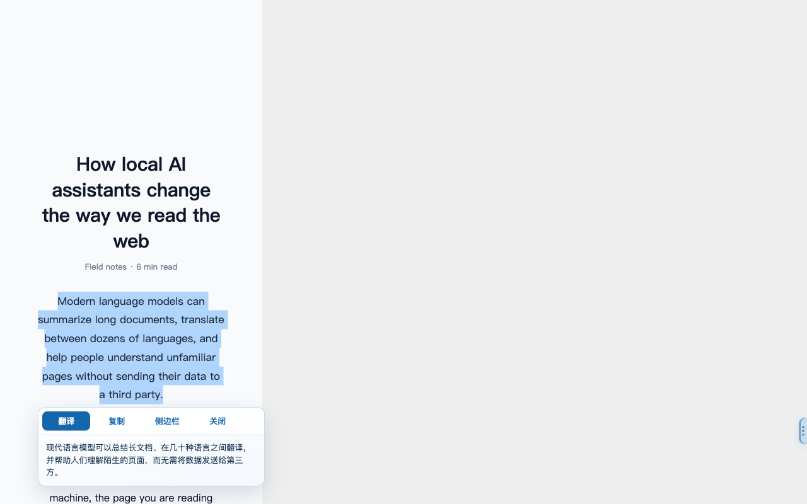
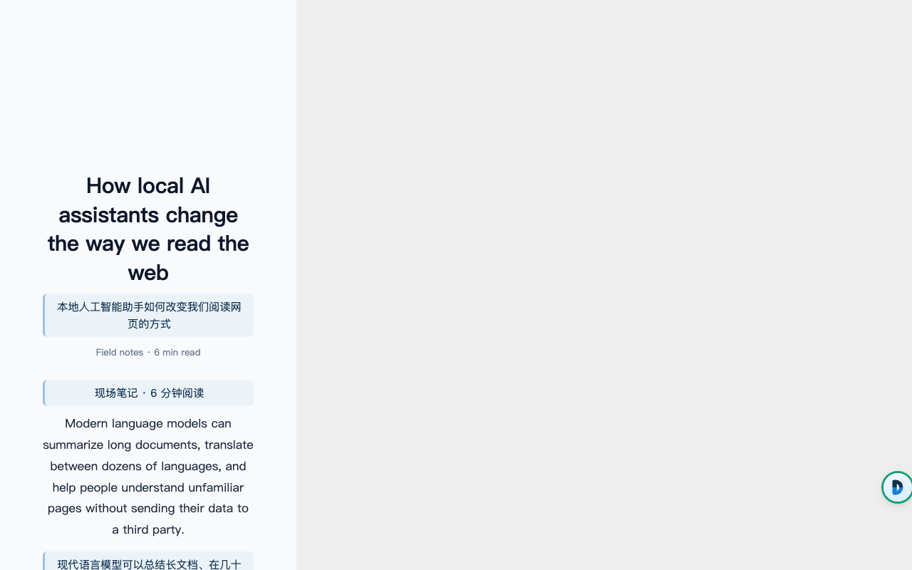
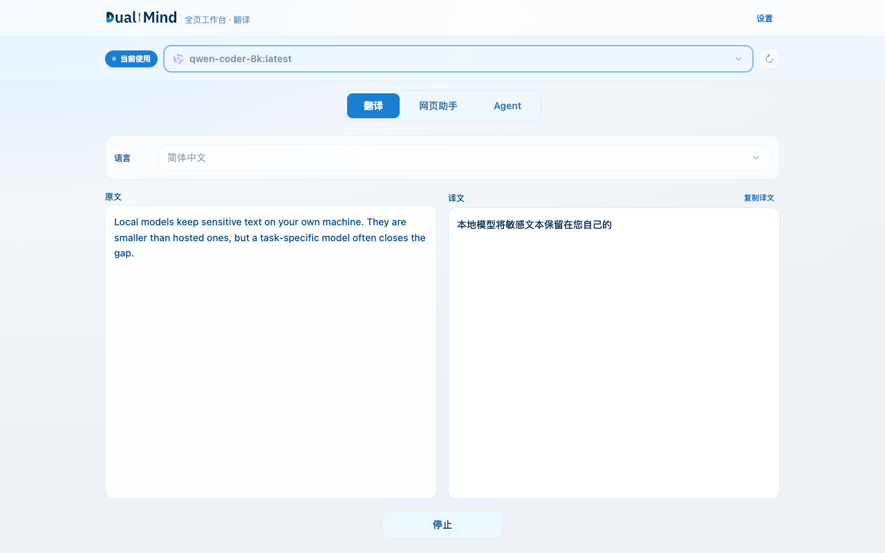
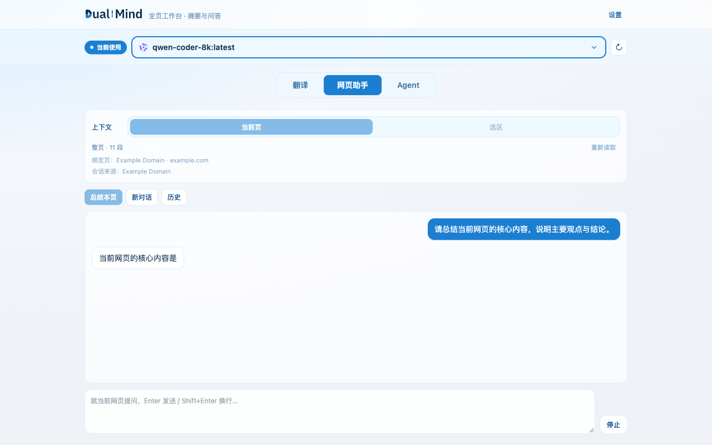
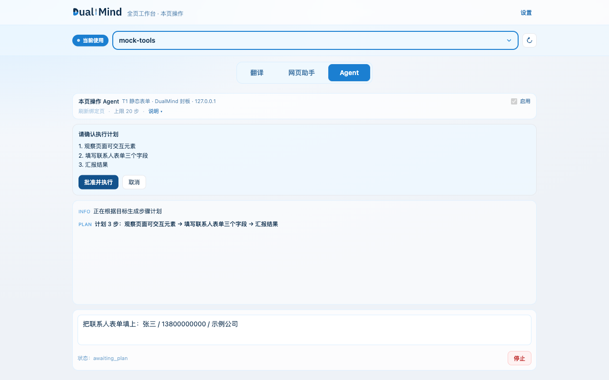
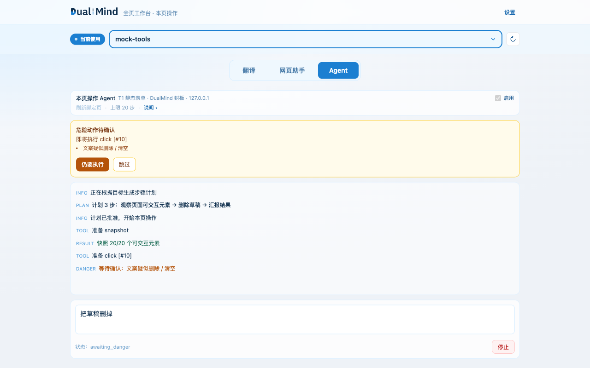

# DualMind

**AI 浏览器助手（BYOK）：划词与整页翻译、网页摘要与问答，以及逐次批准的本页操作 Agent。**

`Manifest V3` · `Chrome ≥ 114`（首轮仅 Chrome，Edge 延后）· 模型自带（OpenAI 兼容 / 本地 Ollama）· 无自有后端 / 无遥测

## 截图

| 划词翻译 | 沉浸式整页双语 | 翻译工作台 |
| --- | --- | --- |
|  |  |  |

| 阅读助手（只读） | 本页 Agent · 计划批准 | 危险动作二次确认 |
| --- | --- | --- |
|  |  |  |

## 能力

三类能力，模型全部由你自己提供（BYOK），没有自有后端，也没有遥测：

1. **翻译**：划词工具栏（`Alt` / `Option` + `K`）+ Side Panel 与全页工作台 + 沉浸式整页双语翻译。
2. **只读阅读助手**：整页摘要 + 针对当前页的问答，全程**不改动页面**。
3. **可选的本页操作 Agent**：用自然语言驱动**当前页**的有限 DOM 操作，**计划批准 + 危险动作二次确认**。

> Agent 安装后即可用，但**不会自动启动任何任务**；每个任务都必须由你显式发起并批准步骤计划。

## 安装

需要 Node.js >= 22（推荐使用 nvm：`nvm use`，仓库已含 `.nvmrc`）。

```bash
pnpm install
pnpm dev
```

Chrome 打开 `chrome://extensions` → 开启开发者模式 → 加载 `.output/chrome-mv3`（或 WXT 提示的目录）。

> 需要 **Chrome ≥ 114**（`sidePanel` API 要求）；首轮仅支持 Chrome，Edge 待验证。

## 使用

1. 打开扩展 **设置**，选择 Provider：
   - **本地 Ollama**：确认本机已启动（默认 `http://127.0.0.1:11434`），点击「刷新列表」选择模型。
   - **OpenAI 兼容**：适用于 DeepSeek / Groq / 各类中转 / 自建 `/v1` 服务等，填写 Base URL（含 `/v1`）、API Key、模型名。
2. 任意网页划词 → 按快捷键 `Alt+K`（macOS 为 `Option+K`）弹出浮层并翻译。默认「仅快捷键」，可在设置改为「选中后自动显示」；改键见 `chrome://extensions/shortcuts`。
3. 点击扩展图标打开 Side Panel，可继续编辑原文并重译；点「工作台」打开加宽的全页（`workspace.html`）并收起侧栏，与侧栏共用同一翻译会话。
4. **沉浸式全文翻译**：把鼠标移到网页右下角的 DualMind 悬浮按钮上，在展开的动作里点「沉浸译」（也可用右键菜单「用 DualMind 翻译整页」），把整页正文逐段对照翻译；再点「显示原文」即可一键还原。展示模式（双语 / 仅译文）与「打开网页后自动翻译」可在设置或侧栏控制区调整。动态加载的内容会自动补译。
5. **阅读助手（只读）**：同一个悬浮按钮里点「总结本页」，在侧栏由 AI 概括当前网页要点，并可**继续针对当前页追问**。按钮可按住拖动换位置（松手自动吸附到左 / 右边缘），位置全局记住。
6. **本页操作 Agent**：在侧栏 / 工作台切到 **Agent** Tab，或点悬浮按钮里的「请 Agent 操作本页」。用自然语言描述目标 → 扩展先给出**步骤计划**，你批准后才开始执行；**提交表单 / 删除类 / 导航到敏感域**等危险动作执行前会**二次确认**，且可随时停止。**支付 / 下单 / 转账等资金类动作直接拒绝**（无法通过确认放行）。Agent 只在**当前内容页**工作，不跨标签页。

## 模型前提

- 翻译与阅读助手：任意 OpenAI 兼容端点或本机 Ollama 均可。
- 本页操作 Agent：**模型必须支持 tool / function calling**。不支持时会在连续两轮零 `tool_calls` 后**明确报错**（`TOOLS_UNSUPPORTED`），不会静默退化成乱点。

## 已知限制

- **首轮仅 Chrome**（≥ 114）；Edge 待验证。
- Agent 只在启动时绑定的**当前内容页**工作，**不跨标签页**，不使用 `debugger` / CDP。
- **Agent 运行态不持久化**：步骤计划 / 轨迹 / 中止标志仅存在于内存；关闭或重启浏览器后不恢复、**不重放**页面操作，须重新发起并重新批准。
- Shadow DOM / 跨域 iframe / 严格 CSP 下的部分元素可能无法操作（会给出可读失败提示）。
- 已发生的页面动作**无法撤销**。
- 低危已知缺陷：产物缺少 `content-scripts/content.css`（两个 Shadow UI 自带内联样式，正确性不受影响，仅每页一次失败请求 + 控制台警告）。完整清单见 [docs/release-notes-v1.0.0.md](docs/release-notes-v1.0.0.md)。

## 权限与隐私

- `storage`：保存设置与翻译会话
- `sidePanel`：侧边栏工作台
- `contextMenus`：右键菜单「用 DualMind 翻译」
- `content_scripts.matches: <all_urls>`：注入划词工具栏与页面悬浮入口（沉浸译 / 总结本页 / 「请 Agent 操作本页」），并提供 Agent 的 DOM 操作通道
- `host_permissions: <all_urls>`：BYOK 直连用户自填的 OpenAI 兼容端点（Background 跨域 `fetch` 必需）
- `http://127.0.0.1:11434/*`、`http://localhost:11434/*`：本地 Ollama

Agent **不新增任何权限**（无 `debugger` / `scripting` / `tabs` / `activeTab`）——它复用现有的内容脚本注入通道。

> 因划词常驻 + BYOK 任意端点，安装时会出现「读取并更改您在所有网站上的数据」警告，属预期行为；完整理由与替代方案对比见 [docs/decisions-v1.md](docs/decisions-v1.md)「权限决策」。
> API Key 仅存本机、仅由 Background 读取、仅用于你配置的端点认证。无遥测、无浏览历史收集、无远程代码。详见 [PRIVACY.md](PRIVACY.md)。

## English

DualMind is a BYOK AI browser assistant (Manifest V3, Chrome ≥ 114) that works on the page you are viewing, with three capabilities:

1. **Translation** — translate selected text instantly, a side-panel / full-page workbench, and immersive full-page bilingual translation.
2. **Read-only reading assistant** — page summary and Q&A about the current page; it never modifies the page.
3. **Optional on-page agent** — natural-language-driven, limited DOM actions on the current page only, with an approved step plan and a second confirmation for dangerous actions. Payment / ordering / transfer actions are refused outright. It never starts a task on its own.

The model is entirely user-provided: any OpenAI-compatible endpoint or local Ollama. No developer-operated backend, no telemetry, no remote code. API keys stay local and are read only by the background service worker.

Privacy policy: [PRIVACY.md](PRIVACY.md) · Support: <https://github.com/zhengzhp/DualMind/issues>

<details>
<summary><b>开发与构建</b>（开发者向）</summary>

### 开发注意事项（踩坑记录）

**WXT 默认会在 Content Script 变更时 reload 所有匹配标签页**（本项目为 `<all_urls>`）。已在 Background 拦截该行为：默认只刷新**当前活动标签**（见 `.env` 的 `WXT_DEV_RELOAD_TABS`）。改完后请 **重启一次 `pnpm dev`** 使 Background 补丁生效。

**改了 Content Script 后，后台标签页不会自动更新。**

- 需要验证的页面请置于前台，或手动刷新；扩展 Reload 后旧标签仍可能跑旧脚本。
- 症状极具迷惑性：表现为「新功能不生效」或「浮层关不掉」，但代码其实是对的。
- 另注意：同时存在 `.output/chrome-mv3` 与 `.output/chrome-mv3-dev` 时，确认加载的是当前 dev 产物。
- 若仍觉得刷太勤：`.env` 设 `WXT_DEV_RELOAD_TABS=none`（完全不自动刷页）。

改动对应关系（便于判断要不要刷新）：

| 改动位置 | 生效方式 |
|----------|----------|
| `features/selection-toolbar/`、`entrypoints/content.ts` | 前台页自动刷 / 或手动刷新 |
| `entrypoints/background.ts` | Reload 扩展（可能短暂打断 SW） |
| `entrypoints/sidepanel`、`entrypoints/workspace`、`entrypoints/options` | 刷新对应扩展页即可 |

**改了快捷键（`wxt.config.ts` 的 `commands.suggested_key`）后，必须卸载并重新安装扩展**：Chrome 只在「首次安装」时采纳 `suggested_key`，Reload / 更新都不会重新绑定（这就是快捷键「描述有、按键为空」的常见原因）。也可在 `chrome://extensions/shortcuts` 手动设置。

### 脚本

| 命令 | 说明 |
|------|------|
| `pnpm dev` | 开发模式（HMR） |
| `pnpm build` | 生产构建 |
| `pnpm zip` | 打包 zip |
| `pnpm compile` | TypeScript 类型检查 |
| `pnpm test` | Vitest 单测（纯逻辑，无外部依赖） |
| `pnpm test:e2e` | Playwright E2E（先 `wxt build`；需本机启动 Ollama 并拉取 `qwen-coder-8k:latest`）；**默认无头** |
| `pnpm test:e2e:headed` | E2E 有头（`E2E_HEADED=1`）：需要观察界面 / 跑真实 Side Panel 用例时使用 |

> CI（`.github/workflows/ci.yml`）只跑 `pnpm compile` + `pnpm test`；E2E 依赖真实本地模型，请在本地执行。

### 架构要点

- 仅 **Background Service Worker** 发起 AI 请求（密钥不出 Content Script）。
- Provider 适配层：`providers/openai-compatible.ts`、`providers/ollama.ts`。
- 能力按 Feature 分包：`features/translate/`（划词 + 工作台）、`features/immersive/`（沉浸式全文翻译，独立消息前缀与 storage）。
- 页面入口：`features/page-fab/`（跨能力的共享悬浮入口，单按钮 + hover 展开 + 拖动吸附），各 feature 注册动作，入口壳不反向依赖它们。
- V2 **已封板**：`features/chat/` + `page-content/` + `page-fab`。
- V3.0 **主链路已实现（首轮发布）**：本页浏览器 Agent（`features/agent/`，独立 `agent:*`；**零新增权限**；计划批准 + 危险动作再确认）。详见 [docs/decisions.md](docs/decisions.md) 与 [docs/architecture-v3.md](docs/architecture-v3.md)。

</details>

<details>
<summary><b>项目文档</b></summary>

| 文档 | 说明 |
|------|------|
| [docs/README.md](docs/README.md) | 文档地图（入口 / 使用时机 / 权威性） |
| [docs/decisions.md](docs/decisions.md) | 当前权威决策（V3） |
| [docs/architecture-v3.md](docs/architecture-v3.md) | 当前权威（V3）架构摘要 |
| [docs/features.md](docs/features.md) | 当前权威（V3）Feature 契约表 |
| [docs/decisions-v2.md](docs/decisions-v2.md) · [docs/architecture-v2.md](docs/architecture-v2.md) · [docs/features-v2.md](docs/features-v2.md) | V2 归档（已封板） |
| [docs/decisions-v1.md](docs/decisions-v1.md) · [docs/architecture-v1.md](docs/architecture-v1.md) · [docs/features-v1.md](docs/features-v1.md) | V1 / V1.5 归档（已封板） |
| [docs/release-notes-v1.0.0.md](docs/release-notes-v1.0.0.md) | v1.0.0 发布说明 / 已知限制 / 回滚预案 |
| [docs/store-listing.md](docs/store-listing.md) | 上架权限用途 / 单一用途 / 数据使用说明 |
| [docs/store-screenshots.md](docs/store-screenshots.md) | 上架截图清单与采集说明 |
| [docs/reviewer-reproduction.md](docs/reviewer-reproduction.md) | 审核员复现步骤 |
| [PRIVACY.md](PRIVACY.md) | 隐私政策（中英双语，对外公开） |
| [docs/cursor-cheatsheet.md](docs/cursor-cheatsheet.md) | Cursor 快捷键与 `/` 命令速查 |
| [AGENTS.md](AGENTS.md) | 给 AI / 协作者的入口说明 |
| `.cursor/rules/` | Cursor 项目规则（自动约束后续对话） |
| `.cursor/commands/` | 项目自定义斜杠命令（输入 `/` 选用） |

> V3 封板 / 上架相关材料（`docs/v3-*`、`docs/review-risk-report.md`）见 [docs/README.md](docs/README.md)「发布材料」一节。

</details>
