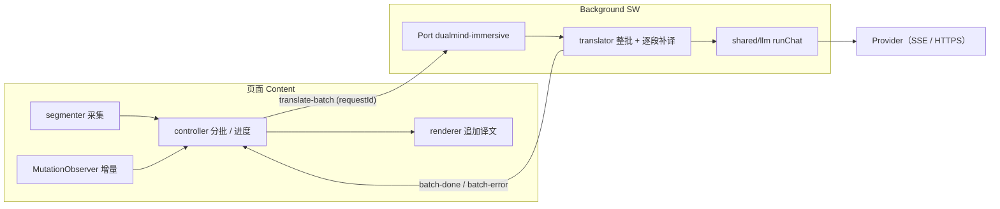

# DualMind 浏览器插件 · 技术架构（V1 / V1.5 · 已封板）

> 状态：**V1 与 V1.5 已封板（功能冻结）**；本文件为归档，不再随新版本更新。
> 阅读：仅历史背景，**按需检索、勿整体阅读**，不作为当前规则来源；地图见 [README.md](./README.md)。
> 当前版本（V3）架构见 [architecture-v3.md](./architecture-v3.md)；V2 归档见 [architecture-v2.md](./architecture-v2.md)。  
> 完整计划原稿见：[.cursor/plans/dualmind_插件架构_b3d3a25e.plan.md](../.cursor/plans/dualmind_插件架构_b3d3a25e.plan.md)  
> 决策摘要见：[decisions-v1.md](./decisions-v1.md)；契约表见 [features-v1.md](./features-v1.md)。  
> 代理入口（边界与汇报约定）见 [AGENTS.md](../AGENTS.md)。

## 定位

网页场景 AI 助手。V1 以翻译切入；后续扩展摘要/聊天/写作，再后置浏览器操作。

## 技术栈

- WXT 0.21 + React + TypeScript + Tailwind
- Chrome / Edge MV3
- BYOK：OpenAI Compatible + 本地 Ollama
- Node.js >= 22

## 目录结构（V1 / V1.5）

```text
entrypoints/          # background / content / sidepanel / workspace / options
features/
  translate/          # 翻译用例、prompt、工作台 UI（侧栏 / 全页共用）
  immersive/          # 沉浸式全文双语翻译（分段 / 分批 / 渲染 / 入口）
  selection-toolbar/  # 划词浮层
providers/            # Provider 适配层（不碰 DOM；支持 chatStream）
shared/
  llm/                # runChat / runChatStream 薄封装
  errors.ts           # 统一错误码与用户文案
  messaging/          # 类型安全消息 + 流式 Port
  storage/            # 设置与会话
  ui/                 # 纯展示组件（SegmentedControl / SearchableSelect 等）
  extensionPages.ts   # 扩展页打开/聚焦与关闭侧栏（不经过 Background）
  dev/                # 开发期辅助（WXT 热更新标签页收敛）
```

Feature 契约表见：[features-v1.md](./features-v1.md)

## 核心原则

1. 只有 Background Service Worker 发起 AI 请求
2. Provider 永不碰 DOM；Content 只负责选区与浮层 UI
3. 能力按 Feature 分包；Chat / Agent 平行扩展，不塞进 TranslateService
4. 权限按版本渐进；Ollama 显式声明本机 `11434` 端口
5. Feature 经 `shared/llm` 调模型；错误经 `shared/errors` 映射文案

## 数据流（划词翻译 · 流式）

Content / Side Panel → Port `dualmind-translate` → Background → `translateTextStream` → `runChatStream` → Provider SSE → chunk 回写 Session + Port → UI（可 abort）

一次性路径：`translate:run`（右键菜单等）仍可用。

## 数据流（沉浸式全文翻译 · 批量）



- 采集与渲染在页面（Content）；模型请求只在 Background。
- 指令入口（悬浮按钮 / 右键 / 侧栏）最终都落到内容脚本的同一个控制器的 `start / stop / toggle`。
- 偏好持久化在 `local:immersivePrefs`；页面译文不落 storage。

## 里程碑状态（V1 / V1.5）

- [x] 脚手架
- [x] Provider（OpenAI Compatible + Ollama）
- [x] TranslateService + messaging
- [x] 划词工具栏
- [x] Side Panel 工作台
- [x] 全页工作台（workspace）
- [x] Options 设置页
- [x] V1 收官（compile / 单测全绿；**功能冻结，仅修 bug**）
- [x] V1.5 沉浸式全文双语翻译（`features/immersive/`；分段 / 分批并发 / 双语渲染 / 增量补译）—— 已封板 2026-10-07

> V3 里程碑与发布闸门见 [architecture-v3.md](./architecture-v3.md)；V2 归档见 [architecture-v2.md](./architecture-v2.md)。

> V1 已冻结：不再新增功能，仅接受 bug 修复。新能力（沉浸译 / Chat / Agent）进入 V1.5+，
> 须先更新 [decisions.md](./decisions.md) 与 [features.md](./features.md)。
