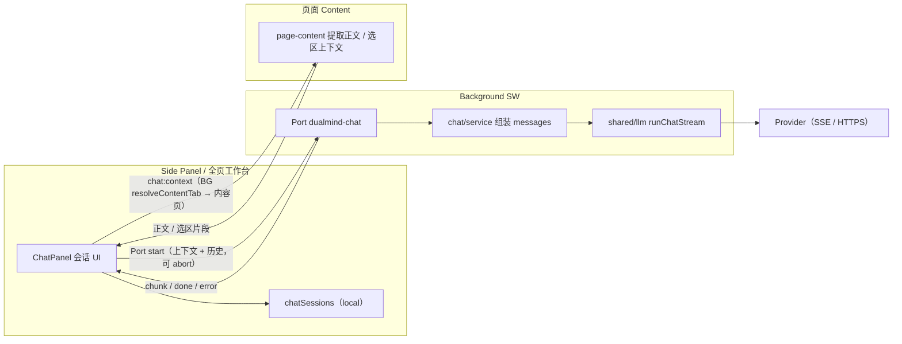

# DualMind 浏览器插件 · 技术架构（V2 · 进行中）

> 生效版本：**V2（网页摘要 / 网页问答，进行中）**。  
> V1 / V1.5 架构（已封板）见 [architecture-v1.md](./architecture-v1.md)。  
> 决策摘要见 [decisions.md](./decisions.md)；契约表见 [features.md](./features.md)。  
> 代理入口（边界与汇报约定）见 [AGENTS.md](../AGENTS.md)。

## 定位

在 V1 / V1.5 翻译能力之上，V2 拓展「网页阅读助手」：**网页摘要**（一键）+ **网页问答**（多轮对话）。

**不做**：PDF / 视频、RAG 向量检索、跨标签页知识库、云同步、搜索增强、邮件回复、Agent 自动化（后置 V2.5+ / V3）。

## 技术栈（沿用 V1，不新增）

- WXT 0.21 + React + TypeScript + Tailwind
- Chrome / Edge MV3
- BYOK：OpenAI Compatible + 本地 Ollama（V2 **不新增**模型接入）
- Node.js >= 22

## 目录增量（相对 V1）

```text
features/
  page-content/       # 语义正文提取 / 分块 / 截断预算 / 选区上下文（chat 与 immersive 共用）
  page-fab/           # 页面共享悬浮入口（贴边把手 peek → 滑出圆形 + 粘性卡片面板 + 拖动吸附）
    types.ts          # 动作协议（PageFabAction / PageFabActionView / PageFabApi）
    position.ts       # 落点计算纯函数（吸附 / 夹取 / 拖拽阈值）+ 单测
    dom.ts            # 样式与渲染（原生 DOM，Shadow DOM 隔离）
    mount.ts          # 挂载、hover 意图、粘性面板与关闭路径、拖拽、位置持久化
  chat/               # 网页摘要 + 网页问答（独立 chat:* 消息）
    types.ts          # 域内运行时类型 + 持久化形状转出
    prompts.ts        # 系统提示 / 上下文拼装 / 历史裁剪（Background 侧组装）
    service.ts        # answerQuestion()：组装 messages → runChatStream
    client.ts         # Port 客户端（Side Panel / 工作台侧，流式 + abort）
    extract.ts        # 内容脚本侧：选区 / 正文提取
    mount.ts          # 注册 content:chat-extract 监听
    ui/               # ChatPanel（面板）/ SessionList（历史）/ useChat（状态机）
```

- `page-content/` 由 `immersive/segmenter.ts` **等价抽取**而来，immersive 改为引用它（既有单测作护栏）。
- `page-fab/` 是**跨能力**的页面入口壳（不是独立 Feature）：沉浸译与网页总结各自 `registerAction` 注册动作，壳不反向依赖它们；沉浸译不再自建悬浮按钮（原 `features/immersive/dom.ts` 的 FAB 渲染改为 `features/immersive/fab.ts` 的状态映射）。
- 其余目录（`entrypoints/` / `providers/` / `shared/`）沿用 V1 结构，见 [architecture-v1.md](./architecture-v1.md)。

Feature 契约表见：[features.md](./features.md)

## 核心原则（沿用 V1，并约束 V2）

1. 只有 Background Service Worker 发起 AI 请求
2. Provider 永不碰 DOM；Content 只负责页面正文 / 选区提取
3. 能力按 Feature 分包；**Chat 独立 `chat:*`**，不塞进 `TranslateService`，不复用 `translateSession`
4. 权限不扩大：复用现有 `<all_urls>` content script，**不引入** `scripting` / `activeTab`
5. 页面正文不落 storage；会话消息落 `local:chatSessions`（全局列表，带 `pageUrl`）

## 数据流（网页摘要 / 网页问答 · 流式）



- 正文提取在页面（Content），模型请求只在 Background；Side Panel / 工作台无法直连页面 DOM，须经 Background 转发到**解析后的内容页**（`resolveContentTab`：活动 http(s) → 最近可读 → `lastAccessed` 兜底；工作台本身是扩展标签，不能当活动页取正文）。
- 会话消息持久化在 `local:chatSessions`（全局列表，带 `pageUrl`）；页面正文不落 storage，只随消息保存已发送的上下文片段。
- 提取层 `features/page-content/` 为 `chat` 与 `immersive` 共用，无独立消息前缀。
- 页面悬浮入口 `features/page-fab/` 是内容脚本侧的共享 UI 壳（非独立 Feature）：沉浸译动作直连本页 `ImmersiveController`（不走消息）；「总结本页」动作只发 `chat:summarize-page`，由 Background 开侧栏 + 写 `local:chatPending`，**不**在内容脚本里直接触达模型或侧栏。落点存 `local:pageFabPos`（全局共享）。
- 入口的**显示逻辑**与能力解耦：静止收成 12px 贴边窄把手（品牌蓝实底 + 页面内侧 2px 实边 + 抓手点，见 [decisions.md](./decisions.md)「把手可辨识性」），指针移入 / 面板展开 / 拖拽中 / 有状态时滑出为完整圆形（`data-peek` / `data-reveal`，由 `attention.ts` 与不透明度**同源**算出）；壳有**显式尺寸**且贴边对齐，面板 / 提示因此天然整块在屏内；面板为卡片形态且**粘性**（关闭靠切换 / 点外 / 头部 `×` / `Esc` / 滚动）。改这里要盯住**两套坐标系**：拖拽全程跟的是**按钮**左边缘，落点写的是**壳**左边缘（相差 `size - peekWidth`，由 `mount.ts` 的 `shellLeftFor` 换算）。细节见 [decisions.md](./decisions.md)「V2 悬浮入口 · UI 显示逻辑改版」。
- 右键菜单「总结本页」不走 runtime 广播：Background 写信箱 `local:chatPending`（消费即清空 + TTL 30s），由**常驻的** `WorkbenchApp` 消费并切到网页助手 Tab，再下发给 `ChatPanel` 执行 —— 因为 `sidePanel.open()` 与面板挂载存在竞态，且 `ChatPanel` 仅在网页助手 Tab 挂载。

## 里程碑状态（V2 / V3）

- [ ] V2 摘要 / 聊天（`features/chat/` + 共享 `features/page-content/`，独立 `chat:*` 消息前缀）—— 进行中（2026-10-07）
- [ ] V3 浏览器 Agent（独立 feature + 强确认 + 独立权限说明）

### 发布闸门（V3 完成后统一执行）

> 决定见 [decisions.md](./decisions.md)「发布与验证节奏」：提审发布、全量验证与 `compile` 均后置到 V3 完成后，此前只做改动所需的最小验证。

- [ ] `pnpm compile`（tsc --noEmit）
- [ ] `pnpm test`（Vitest 全量）
- [ ] `pnpm build` → `pnpm test:e2e`（真实 Ollama；需观察界面时用 `pnpm test:e2e:headed`）
- [ ] 复核 [store-listing.md](./store-listing.md) 与最终 `manifest` 的权限 / 单一用途 / 数据使用一致
- [ ] 提审 Chrome Web Store / Edge Add-ons
