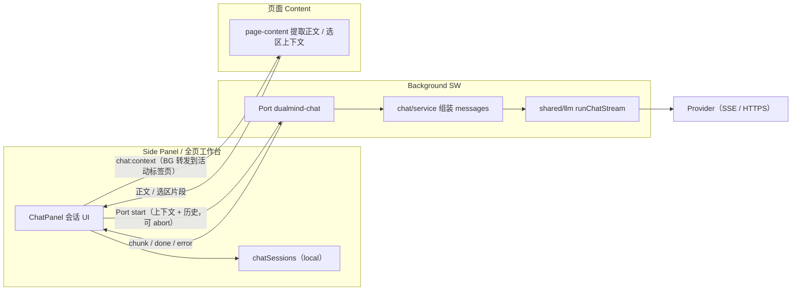

# DualMind 浏览器插件 · 技术架构（V2 · 进行中）

> 生效版本：**V2（网页摘要 / 网页问答，进行中）**。  
> V1 / V1.5 架构（已封板）见 [architecture-v1.md](./architecture-v1.md)。  
> 决策摘要见 [decisions.md](./decisions.md)；契约表见 [features.md](./features.md)。  
> 代理入口（边界与汇报约定）见 [AGENTS.md](../AGENTS.md)。

## 定位

在 V1 / V1.5 翻译能力之上，V2 拓展「网页阅读助手」：**网页摘要**（一键）+ **网页问答**（多轮对话）。

**不做**：PDF / 视频、RAG 向量检索、跨标签页知识库、云同步、搜索增强、邮件回复、Agent 自动化（后置 V2.5+ / V3）。

## 技术栈（沿用 V1，不新增）

- WXT 0.21 + React + TypeScript + Tailwind
- Chrome / Edge MV3
- BYOK：OpenAI Compatible + 本地 Ollama（V2 **不新增**模型接入）
- Node.js >= 22

## 目录增量（相对 V1）

```text
features/
  page-content/       # 语义正文提取 / 分块 / 截断预算 / 选区上下文（chat 与 immersive 共用）
  chat/               # 网页摘要 + 网页问答（独立 chat:* 消息）
```

- `page-content/` 由 `immersive/segmenter.ts` **等价抽取**而来，immersive 改为引用它（既有单测作护栏）。
- 其余目录（`entrypoints/` / `providers/` / `shared/`）沿用 V1 结构，见 [architecture-v1.md](./architecture-v1.md)。

Feature 契约表见：[features.md](./features.md)

## 核心原则（沿用 V1，并约束 V2）

1. 只有 Background Service Worker 发起 AI 请求
2. Provider 永不碰 DOM；Content 只负责页面正文 / 选区提取
3. 能力按 Feature 分包；**Chat 独立 `chat:*`**，不塞进 `TranslateService`，不复用 `translateSession`
4. 权限不扩大：复用现有 `<all_urls>` content script，**不引入** `scripting` / `activeTab`
5. 页面正文不落 storage；会话消息落 `local:chatSessions`（全局列表，带 `pageUrl`）

## 数据流（网页摘要 / 网页问答 · 流式）



- 正文提取在页面（Content），模型请求只在 Background；Side Panel 无法直连页面 DOM，须经 Background 转发到活动标签页。
- 会话消息持久化在 `local:chatSessions`（全局列表，带 `pageUrl`）；页面正文不落 storage，只随消息保存已发送的上下文片段。
- 提取层 `features/page-content/` 为 `chat` 与 `immersive` 共用，无独立消息前缀。

## 里程碑状态（V2 / V3）

- [ ] V2 摘要 / 聊天（`features/chat/` + 共享 `features/page-content/`，独立 `chat:*` 消息前缀）—— 进行中（2026-10-07）
- [ ] V3 浏览器 Agent（独立 feature + 强确认 + 独立权限说明）

### 发布闸门（V3 完成后统一执行）

> 决定见 [decisions.md](./decisions.md)「发布与验证节奏」：提审发布、全量验证与 `compile` 均后置到 V3 完成后，此前只做改动所需的最小验证。

- [ ] `pnpm compile`（tsc --noEmit）
- [ ] `pnpm test`（Vitest 全量）
- [ ] `pnpm build` → `pnpm test:e2e`（真实 Ollama；需观察界面时用 `pnpm test:e2e:headed`）
- [ ] 复核 [store-listing.md](./store-listing.md) 与最终 `manifest` 的权限 / 单一用途 / 数据使用一致
- [ ] 提审 Chrome Web Store / Edge Add-ons
