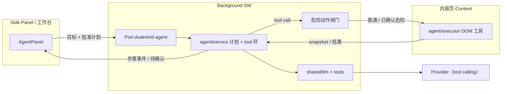

# DualMind 浏览器插件 · 技术架构（V3 · 已立项）

> 状态：**V3（浏览器 Agent）已立项，实现中**；本文件为当前权威架构。  
> V2 架构归档见 [architecture-v2.md](./architecture-v2.md)；V1 / V1.5 见 [architecture-v1.md](./architecture-v1.md)。  
> 决策摘要见 [decisions.md](./decisions.md)；契约表见 [features.md](./features.md)。  
> 代理入口见 [AGENTS.md](../AGENTS.md)。

## 定位

在 V1～V2（翻译 / 沉浸译 / 网页摘要与问答）之上，增加**本页浏览器 Agent**：自然语言 → 计划 → 经确认后用 DOM 工具逐步操作当前内容页。

**不做（V3.0）**：CDP / `debugger`、跨 Tab 自动化、MCP、定时任务、CAPTCHA、云浏览器、PDF / RAG / 云同步等（详见 [decisions.md](./decisions.md)）。

## 技术栈（沿用，增量）

- WXT 0.21 + React + TypeScript + Tailwind
- Chrome / Edge MV3
- BYOK：OpenAI Compatible + 本地 Ollama（须 **tool calling**）
- Node.js >= 22
- V3.0 **不新增** manifest 权限

## 目录增量（相对 V2）

```text
features/
  agent/                 # 本页 Agent（独立 agent:*）
    types.ts             # 计划 / 步骤 / 危险动作 / 工具结果
    tools.ts             # 工具 schema（给 LLM）与纯函数校验
    prompts.ts           # 系统提示与计划约束
    service.ts           # Background：tool-calling 环 + 确认闸门
    client.ts            # Port 客户端（Side Panel / 工作台）
    executor.ts          # 内容脚本：snapshot / click / fill / …
    mount.ts             # 注册内容脚本执行监听
    danger.ts            # 危险动作分类（纯函数 + 单测）
    ui/                  # AgentPanel：计划卡 / 步骤时间线 / 停止 / 确认条
```

- 复用 `features/chat/resolveContentTab.ts`（或上提 `shared/`，实现时选成本更低者）
- 可选：`page-fab` 注册 Agent 动作（壳不反向依赖）
- `shared/llm`：`runChatWithTools` / `runChatStreamWithTools`（流式 tool_calls + 多轮；协议层已通，Agent 环待接）
- 其余目录沿用 V2 / V1，见归档架构文档

Feature 契约表见：[features.md](./features.md)

## 核心原则（沿用并约束 V3）

1. 只有 Background 发起 AI 请求与 tool-calling 编排
2. Provider 永不碰 DOM；Content 只执行已批准的工具调用
3. **Agent 独立 `agent:*`**，不塞进 Translate / Chat
4. V3.0 权限不扩大：无 `debugger` / `scripting`
5. 计划批准 + 危险动作二次确认；金融域默认拒绝自动执行
6. 用户随时 abort；迟到回包按任务 id 丢弃（对齐 Chat 会话切换纪律）

## 数据流（本页 Agent · 示意）



- 内容页解析与 Chat 共用 `resolveContentTab`
- 快照以可交互元素 **index** 为主，降低脆弱选择器依赖
- Shadow DOM / 跨域 iframe / 严 CSP：V3.0 声明限制，失败可读提示

## 里程碑

- [x] V2 摘要 / 聊天 —— **已封板**（见 [decisions-v2.md](./decisions-v2.md)）
- [x] V3.0 本页 Agent（零新增权限 + 计划批准 + 危险确认）—— **主链路已接**（实机验收与发布闸门仍待做）
- [ ] V3.1 可选 debugger / 有限多 Tab / 步骤导出 —— 未立项
- [ ] V3.2 配方 / 可选 MCP —— 未立项

### 发布闸门（V3 完成后统一执行）

> 决定见 [decisions.md](./decisions.md)「发布与验证节奏」。

- [ ] `pnpm compile`（tsc --noEmit）
- [ ] `pnpm test`（Vitest 全量）
- [ ] `pnpm build` → `pnpm test:e2e`（真实 Ollama；需观察界面时用 `pnpm test:e2e:headed`）
- [ ] 复核 [store-listing.md](./store-listing.md) 与最终 `manifest` 的权限 / 单一用途 / 数据使用一致
- [ ] 提审 Chrome Web Store / Edge Add-ons
